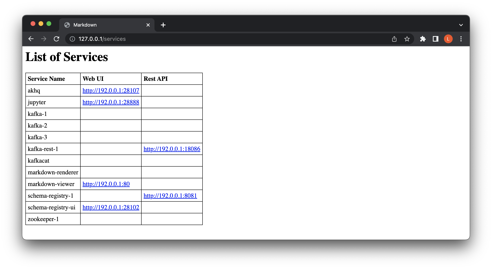

# Prüfungsleistung - Programmentwurf

|                  |                      |
| ---------------- | -------------------- |
| Vorlesung        | Big Data Programming |
| Dozentin         | Lisa Weinzierl       |
|                  | DHBW Ravensburg      |
| Kurs             | RV-WWIDS120          |
| Name Studierende | Lena Hammerer        |
| Matrikelnummer   | xxxxxx               |

## Aufgabe 1: Infrastruktur
### a. Ansicht Docker-Container

### b. Ansicht gestartete Services im Browser

### c. Ansicht Jupyter Lab im Browser

## Augabe 2: Architektur
Eine **Event-zentrische Architektur** bietet sich an, um aus publizierten Sensordaten von einer Webseite, eine real-time Grafik zu erstellen. Das Ziel von Event-zentrischen Konzepten ist die Bereitstellung von Ereignissen (Events) an Konsumenten. Der Weg der Ereignisse verläuft ausgehend von der Quelle (Producer) zum Empfänger (Consumer) und nicht umgekehrt. Producer und Consumer kennen einander dabei nicht, sie sind stattdessen über einen sogenannten Event Broker verbunden. Die Daten werden von einer Datenquelle (z.B. OpenWeatherMap Sensordaten) gesammelt und in den Event Broker geschrieben. Anschließend kann die publizierte Nachricht (Message) von unterschiedlichen Consumern (z.B. Visualisierung der Daten) konsumiert werden. Das kann entweder in Form einer aktiven Nachfrage auf neue Messages (Polling) oder den automatischen Empfang von Nachrichten (Pushing) erfolgen. Apache Kafka als Event Broker funktioniert Pull-basiert.

Durch eine Event-zentrische Architektur ergeben sich verschiedenen **Vorteile**. Es entsteht eine hohe Agilität für die Präsentation der Daten. Es können z.B. jederzeit Daten in neue Datenbanken aufgenommen werden. Zusätzlich macht die Möglichkeit für natives Streaming die Architektur zukunftssicher. Die Single-Source-of-Truth verlagert sich von den Datenbanken auf den Event Broker und die Streaming Pipeline wird zur zentralen Schiene für die Weiterleitung von Information. Die Verarbeitung erfolgt konstant Stream-basiert. Datenquellen und Konsumenten sind lose gekoppelt. 

Im Event-zentrischen Ansatz entstehen auch **Nachteile**. Die Architektur gestaltet sich meist komplexer als ein klassischer Daten-zentrischer Ansatz. Der hohe Stellenwert des Event Brokers macht ihn gleichzeitig zur kritischen Komponente. Wenn der Event Broker vollständig ausfällt, scheitert die Architektur. Allerdings kann das Problem des Single-Point-of-Failure durch mehrere gleichwertig, redundant ausgestattete Elemente im Cluster und eine dadurch entstehende hohe Verfügbarkeit gelöst werden.

## Aufgabe 3: Buffern

Das Ziel des Bufferns ist es, einen möglichen Service-Ausfall abzufangen. Zu diesem Zweck werden Daten häufiger von OpenWeatherMap abgefragt, als eigentlich neue Wetter-Vorhersagen zur Verfügung gestellt werden. Für den Free Plan von OpenWeatherMap ist der Updatezyklus weniger als 2 Stunden (siehe [OpenWeatherMap.org](https://openweathermap.org/full-price#current)). 

Die `collect_forecast_data()` Funktion im [Collect Data Microservice](CollectData.ipynb) übernimmt die Aufgabe des Bufferings. Der Vorgang besteht aus folgenden Schritten:
- Laden der Standorte durch `load_locations()` aus der [locations.json](locations.json), welche mithilfe von [geocoding.py](geocoding.py) und der OpenWeatherMap Geocoding API erstellt wurde. 
- Solange bis die Ausführung des Service unterbrochen wird Wetter-Vorhersage von OpenWeatherMap für jede Stadt im Standort-JSON mithilfe von [OpenWeatherMap.py](OpenWeatherMap.py) in der Funktion `get_transformed_forecast()` abfragen. Aus der API Response werden die relevanten Temperatur-Informationen herausgefiltert und zu einem gemeinsamen Vorhersage Dictionary zusammengeführt. **In der [Environment-Datei](template.env) muss ein gültiger API-Key für openweathermap.org hinterlegt werden!**
- Speichern einer neuen Message im Kafka Topic `weather.forecast` mithilfe von einem `KafkaConfluentWriter()` aus [Kafka.py](Kafka.py). Die aktuelle Zeit und Datum Kombination (auf die Minute genau) dient als Key und das Vorhersage Dictionary als Value der neuen Message. Die Datei [Kafka.py](Kafka.py) beinhaltet unterschiedliche Klassen und Funktionen für die Interaktion mit dem Kafka Server. **In der [Environment-Datei](template.env) muss der Kafka Bootstrap-Server hinterlegt werden!**
- 60 Sekunden warten und wiederholen.

Es werden solange der Service ausgeführt wird neue Daten von OpenWeatherMap in Kafka gebuffert. Neue Standorten können durch eine Erweiterung der Einträge in [locations.json](locations.json) via [geocoding.py](geocoding.py) aufgenommen werden. 

*Limitationen: Bei einer Veränderung des Rsesponse-Schema durch OpenWeatherMap.org müssen Anpassungen im Code vorgenommen werden.*

## Aufgabe 4: Dubletten
Durch die durch das Buffering verursachten, häufigen API-Anfragen lassen sich doppelte Werte im `weather.forecast` Topic finden. Diese doppelten Werte sind für die Visualisierung später nicht interessant und sollen aussortiert werden. In einem neuen Topic `weather.cleaned` sollen Wetter-Vorhersagen ohne Duplikate "gespeichert" werden. In der Streaming-Pipeline wird zu diesem Zweck der zusätzliche [Microservice Data Deduplication](CleanData.ipynb) eingesetzt. Die `clean_forecast_data()` Funktion übernimmt die Aufgabe der Bereinigung von Duplikaten. Der Vorgang besteht aus folgenden Schritten:
- Solange bis die Ausführung des Service unterbrochen wird mithilfe von einem `KafkaConfluentReader()` aus [Kafka.py](Kafka.py) auf neue Messages im `weather.forecast` Topic warten.
- Wenn eine neue Message gelesen wird, den aktuellsten Wert mithilfe von einem weiteren `KafkaConfluentReader()` aus [Kafka.py](Kafka.py) über die Funktion `get_latest_message()` aus dem bereinigten Topic `weather.cleaned` auslesen.
- Überprüfung, ob die neue Message bereits im Duplikat-freien Topic vorhanden ist. Falls nein, wird die Message mithilfe von einem `KafkaConfluentWriter()` aus [Kafka.py](Kafka.py) in das bereinigten Topic geschrieben, ansonsten passiert nichts.

Es wird also solange der Service ausgeführt wird auf neue Messages im `weather.forecast` Topic gewartet und diese ggf. in das bereinigte Topic ohne Duplikate `weather.cleaned` weitergeleitet. 

*Limitationen: Die Wetter-Vorhersage für eine einzelne Stadt wird zwar laut [OpenWeatherMap.org](https://openweathermap.org/full-price#current) nur alle <2 Stunden aktualisiert, allerdings werden für diese Umsetzung Wetter-Vorhersagen von unterschiedlichen Städten in einer gemeinsamen Message gebündelt. Der Zeitpunkt der Aktualisierung der Wetter-Vorhersage ist für unterschiedliche Standorten nicht gleich. Daraus ergibt sich, dass umso größer die Liste der betrachteten Städte, umso weniger doppelte Messages entstehen, da die Wahrscheinlichkeit steigt, dass bei der API-Abfrage eine der inkludierten Städte eine neue Wetter-Vorhersage erhält und es sich dadurch um eine insgesamt nicht doppelte Message handelt.*

## Aufgabe 5: Infografik
Die grafische Darstellung der Wetter-Vorhersagen findet sich in der Datei [ShowData.ipynb](ShowData.ipynb). Die Wetterkarte wurde mit dem Package [Plotly](https://plotly.com/python/) erstellt. Die selbst erstellte Klasse `InfoMap` bündelt Funktionen für die Anzeige der Daten auf einer dynamischen Karte. Konkret werden folgende Schritte benötig:
- Einmalige Abfragen der Daten aus Kafka von dem bereinigten `weather.cleaned` Topic
- Laden der Standortdaten aus [locations.json](locations.json)
- Vorbereiten der Daten für die Darstellung auf einer Karte
- Erstellen der eigentlichen Wetterkarte

Die eingesetzte Art von Grafik aus dem Plotly Package, nutzt [MapBox](https://www.mapbox.com/) für die geographische Darstellung. **In der [Environment-Datei](template.env) muss ein gültiger API-Key für mapbox.com hinterlegt werden!** (Hinweis: MapBox bietet eine Reihe von Möglichkeiten für die Anzeige einer Karte, in der in dieser Ausarbeitung genutzt Visualisierung werden aktiv keine Styles genutzt, welche einen MapBox API-Key erfordern.)

Durch wiederholtes Ausführen der Zelle mit dem `infoMap1.update_map()` Befehl kann die Karte manuell aktualisiert werden. Die angezeigte Visualisierung gibt dem Benutzer die Möglichkeit, sich über die Temperatur in unterschiedlichen Städten im Zeitverlauf zu informieren. Die Temperatur wird dabei durch die **Farbgebung der einzelnen Marker** vermittelt. Es ist möglich, sich durch Zoomen und Scrollen auf der Karte zu bewegen. Zusätzlich kann der Benutzer weitere Informationen durch ein **Hovern** über einer der Städte einsehen. Hier wird die genaue Temperatur sowie eine kleine **Temperatur-Empfehlung** angezeigt. Die Wetter-Vorhersage für die kommenden Stunden und Tage kann über den **Slider** am unteren Rand der Karte ausgewählt werden. Basierend auf der Position des Sliders ändert sich die Visualisierung auf der Karte automatisch entsprechend den Vorhersage-Daten.

Abb.: Infografik Wetter-Vorhersage Temperatur

## Aufgabe 6: Infografik automatisiert
Eine automatisch synchron gehaltene Darstellung der Wetter-Vorhersage findet sich ebenfalls in der Datei [ShowData.ipynb](ShowData.ipynb). Es wird erneut Logik aus der selbst erstellten Klasse [InfoMap.py](InfoMap.py) genutzt. Nach dem initialen Start der Synchronisierungs-Logik über die Zelle mit den Befehl `infoMap2.synced_map()` bleibt die Wetterkarte automatisch auf dem neusten Stand. Wenn die Ausführung dieser Zelle beendet wird, stoppt die Synchronisation ebenfalls. Folgende Änderungen der Herangehensweise im Vergleich zu Aufgabe 5 sind dafür notwendig:
- Laufende Abfrage auf neue Daten aus Kafka (Polling) von dem bereinigten `weather.cleaned` Topic.
- Wenn eine neue Message verfügbar ist erfolgt eine Prüfung, ob es sich um einen aktuelleren Erfassungszeitpunkt handelt als bei der ggf. bereits dargestellten Karte.
- Wenn es sich um aktuellere Daten handelt, wird die Datenbasis für die Wetterkarte angepasst, der aktuelle Output der Zelle entfernt und eine neue Wetterkarte erstellt und angezeigt. Ansonsten verbleibt die Darstellung bei der bisherigen Karte mit bereits aktuellen Vorhersage-Daten.

Im Vergleich zur Aufgabe 5, wo der Zugriff auf die Daten im Sinne von **Batch-Processing** erfolgt ist, kann man nun von einem **Stream-Processing** Ansatz sprechen. Neue Daten werden verarbeitet sobald sie Verfügbar sind und werden nicht über einen gewissen Zeitraum gespeichert und in Blöcken verarbeitet.